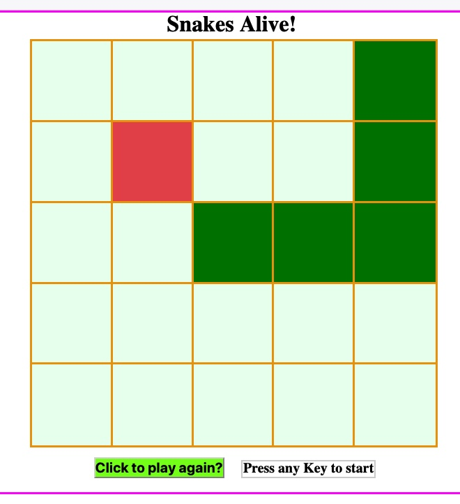

# Snakes Alive!

This is my homage to the original snake game.

## Installation Instructions

1. Copy files locally to your machine
1. Copy path to Index file and paste into Firefox
1. Follow the onscreen instructions. Our snake is green and moved by the arrow keys.  Food is red and appears periodically.  Eating food causes your snake to grow.
1. Have fun!

## Descriptions
The snake game made famous in the 80s is reproduced here. 

## Example

## List of Features / User Stories
The game shall:
1.  __[x]__ take keyboard input when the screen is in focus.
1. __[x]__ add a snake head to the grid upon pressing of any key stroke.
1. __[x]__ default the location to the center of the grid.
1. __[x]__ shall move the snake head by use of the arrow keys.
1. __[x]__ make food appear periodically on the grid.
1. __[x]__ when the snake travels over the food it shall eat the food and grow an additional body segment.
1. __[x]__ ensure the snake body segments follow only the path prescribed by the snake head.
1. __[x]__ inform the user when the game is over.
1. __[x]__ kill the snake if it turns back on itself.
1. __[x]__ kill the snake if it attempts to run off the grid.
1. __[x]__ kill the snake if it attempts to eat its body.
1. __[x]__ inform the user of game status.
1. __[x]__ allow the user to play again.
1. __[x]__ not allow the user to restart a game in-progress by clicking the play again button.

## Technologies used:
1. HTML
1. Javascript (JS)
1. CSS

## Most important factors in the creation of this code:
* Imagination
* Perserverance
* Optimism
* And the courage to take on something that was decsribed as complicated/challenging by our instructors. 

## Requirements

__[x]__ Technical Requirements
Your game must:
__[x]__ Render in the browser
Include separate HTML / CSS / JavaScript files
Use JavaScript for DOM manipulation
__[x]__ Be deployed online, using Github Project pages and/or to a custom domain.
__[x]__ Use semantic markup for HTML and CSS (adhere to best practices)
__[x]__ Show a good commit history with frequent commits
__[x]__ Additionally, your project should stick with KISS (Keep It Stupid Simple) and DRY (Don't Repeat Yourself) principles.

## Known Bugs
1. __[]__ Food can drop on the snakes body.  Issue persists due to feature list priority as this doesn't impact general game play.

## Opportunities for improvement
1. __[]__ __Keep Score__ -  Save off, with user name, the top three high scores to the server.
1. __[]__ __Velocity__ - Add an initial velocity vector to the snake.
1. __[]__ __Randomize food location__ - Current implementation uses a fixed array.  Update to randomly select not snake locations.
1. __[]__ __Refactor code__ - Improve readability, reduce variables and improve f() calls.
1. __[]__ __Grid Size__ - Allow the user to specify the grid size.  Currently, a global CONST is used to define it but some magic numbers exist in the code, although I tried to minimize this as I had this feature in mind when starting out.
1. __[]__ __Increase Velocity__ - Increase the snake velocity after "n" number of food units eaten.
1. __[]__ __Specify USer Level__ - Allow the user to specify easy, medium or hard for initial velocity vector and resultant gameplay.
1. __[]__ __CSS__ - Improve css for better layout of status label and change font fro something more modern, or 80s style, in appearance.
1. __[]__ __Add Graphics__ - Have graphic elements for the snake and the food.  E.g. head, body segment and tail segment(s) have different graphics that change when heading changes.

## Contributions Guidelines
1. Not accepting contributions at this time as this project is used for my learning.

* [Front End Git Hub for Snakes Alive](https://github.com/MarkStuebs/frontend_game)

## Plagiarism

Take a moment to refamiliarize yourself with the
[Plagiarism policy](https://git.generalassemb.ly/DC-WDI/Administrative/blob/master/plagiarism.md).
Plagiarized work will not be accepted.

## [License](LICENSE)

1.  All content is licensed under a CC­BY­NC­SA 4.0 license.
1.  All software code is licensed under GNU GPLv3. For commercial use or
    alternative licensing, please contact legal@ga.co.
